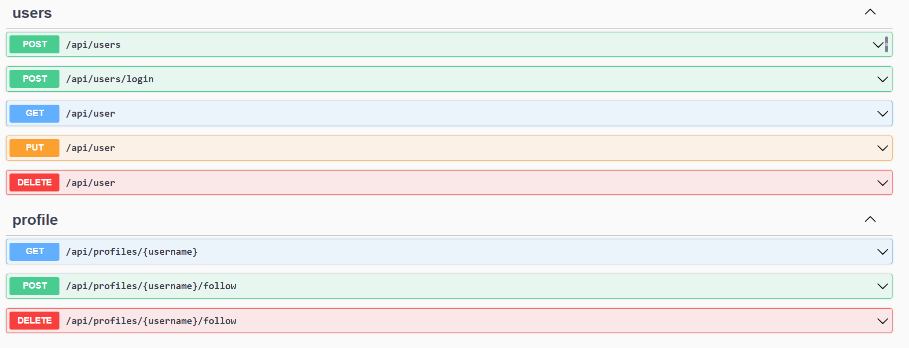

<p align="center">
  <a href="http://nestjs.com/" target="blank"></a>
</p>

I implemented the backend spec for the [Realworld](realworld.how).

## Stack

- [Nest.js](nestjs.com) - Backend Framework
- [Prisma](prisma.io) - ORM
- [Zod](zod.dev) - Data Validation
- [JWT](https://www.npmjs.com/package/jsonwebtoken), [Bcrypt](https://www.npmjs.com/package/bcrypt) - User Authenticaton
- [Jest](https://jestjs.io/) - Testing

## Running the app

1. Make sure you have  [Git](https://git-scm.com/), [Node.js](https://nodejs.org/en) and [Docker](https://docker.com) installed.

2. Clone the repo:

  ```sh
  $ git clone https://github.com/ch1n3du/realworld-nest
  ```

4. Make sure your Docker daemon is on and start the Docker container

  ```bash
  $ docker-compose up -d
    ...
  ```
  The API will be available at port `localhost:8080/api` 

5. OpenAPI docs are available at `localhost:8080/api/docs`



[pls hire me 🥺](https://www.linkedin.com/in/ch1n3du/)
